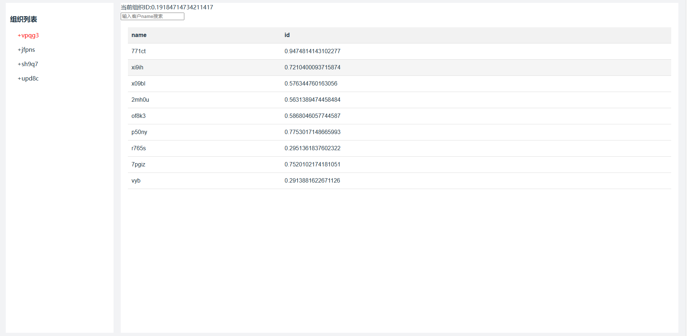

### 功能截图




### 如何将如下的`JSON`正确解析成 `Object`
```json
{
  "userId": 111323290434354540545
}
```
使用 JSON.parse() 解析 JSON字符串

### 前端需要*稳定*每隔`1s`向服务端请求`API`, 请问如何实现？

```javascript
//使用 setInterval 来实现,注意定时器绑定的元素,绑定在页面或者组件 要监听对应的卸载生命周期函数 执行 clearInterval
let count = 0
let timer = setInterval(()=>{
  //要执行的函数
  count++
  if(count == 5) {
    clearInterval(timer)
  }
},1000)
```

### 什么情况下，你会为你的项目引入状态管理库，比如`Redux`, `Pinia`, 可以简述一下起到了什么作用么？
1.当多个组件需要共享状态时候 比如多步骤表单,复杂的用户界面
2.主题切换和设置，全局储存 主题样式
3.储存用户的登录状态 权限信息等

作用： 
起到了集中管理状态的作用，避免状态在组件树中通过props逐级传递；
提高组件复用性，组件和数据脱离，灵活性更强；
在多人协作时效率更高，代码可读性强；

### 为什么`ESM`与`CJS`不能兼容？

ESM和CJS不兼容性主要是由于它们在设计、加载和使用模块时的不同之处,本身是两种规范。差异过多混用时候会导致错误的行为

1.设计差异：ESM 使用 import 和 export 来导入和导出；CJS使用 require 和 module.exports 或 exports 来导入和导出

2.加载时机差异 ESM的模块不能动态加载， CJS 可以

3.导出时：ESM 可以导出任意值，CJS通常只导出一个对象


